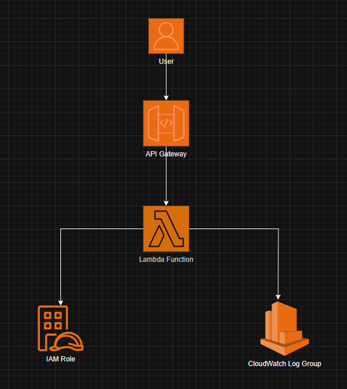

# terraform-aws-modular-lambda-api

A modular Terraform project for deploying AWS Lambda functions with API Gateway, IAM roles, and CloudWatch log groups. Supports environment separation and reusable infrastructure components.

---

## Architecture



**Design Overview:**
- User requests go to API Gateway (HTTP API)
- API Gateway triggers the Lambda function
- Lambda writes logs to CloudWatch Log Group and assumes the IAM Role for permissions
- All resources are managed as separate, reusable modules

---

## Project Structure

```
modules/
  iam-role/
    main.tf
  cloudwatch-log-group/
    main.tf
  lambda-function/
    main.tf
  api-gateway/
    main.tf

env/
  main.tf
  variables.tf
```

---

## Getting Started

### Prerequisites
- [Terraform](https://www.terraform.io/downloads.html) >= 1.0
- AWS credentials configured (via environment variables, AWS CLI, or credentials file)

### Setup & Usage
1. **Clone the repository:**
   ```sh
   git clone https://github.com/bushmusi/terraform-aws-modular-lambda-api.git
   cd terraform-aws-modular-lambda-api
   ```
2. **Review and customize variables:**
   - Edit `env/variables.tf` to set your desired values (e.g., Lambda name, tags, etc.)
3. **Add your Lambda deployment package:**
   - Place your `lambda_function_payload.zip` in the project root or update the path in the module if needed.
4. **Initialize Terraform:**
   ```sh
   cd env
   terraform init
   ```
5. **Plan and apply:**
   ```sh
   terraform plan
   terraform apply
   ```
6. **Destroy (when done):**
   ```sh
   terraform destroy
   ```

---

## Customization
- You can add more environments by copying the `env` directory and adjusting variables.
- Each module is reusable and can be extended for more advanced use cases.

---

## Author
- **GitHub:** [bushmusi](https://github.com/bushmusi)
- **LinkedIn:** [Bushra Mustofa](https://www.linkedin.com/in/bushra-mustofa/)
